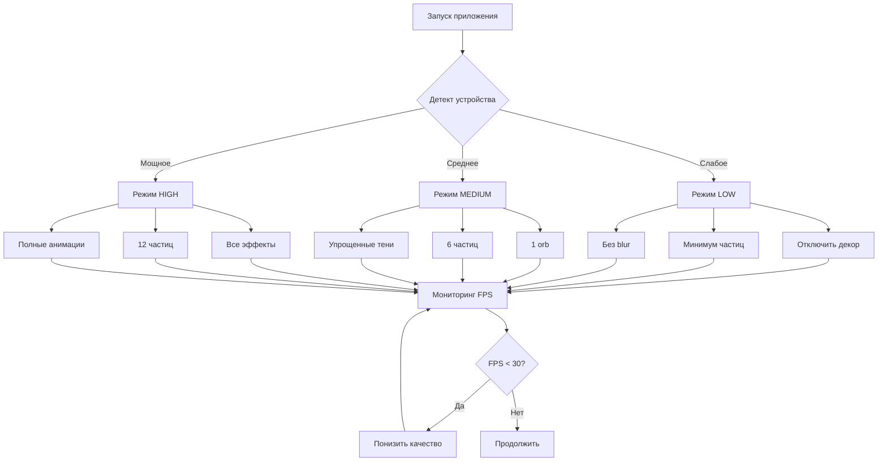

# План оптимизации производительности Wim Hof Breathing App

## Анализ текущих проблем

### Критические проблемы производительности

#### 1. **Избыточные CSS анимации (высокий приоритет)**
- **Проблема**: Одновременно работают 10+ постоянных анимаций
  - 3 ambient orbs с `filter: blur(80-100px)` - очень дорогая операция
  - 10 ambient particles с постоянной анимацией
  - Множественные `box-shadow`, `filter`, `backdrop-filter`
  - Анимации с `hue-rotate`, `brightness` - триггеры перерисовки
- **Влияние**: Постоянная нагрузка на GPU, перегрев устройства
- **Решение**: Упростить/отключить декоративные эффекты на слабых устройствах

#### 2. **Неоптимальные JavaScript анимации (высокий приоритет)**
- **Проблема**: 
  - `requestAnimationFrame` работает постоянно даже когда не нужен
  - Создание 12 частиц при каждом вдохе/выдохе (каждые 1-2 сек)
  - Множественные `classList.remove/add` вызывают reflow
  - `void element.offsetWidth` для принудительного reflow
- **Влияние**: Высокая нагрузка на CPU, быстрый разряд батареи
- **Решение**: Переиспользовать элементы, минимизировать DOM манипуляции

#### 3. **Проблемы с аудио (средний приоритет)**
- **Проблема**:
  - Аудио файлы с `preload="none"` загружаются при каждом воспроизведении
  - Множественные `play().catch()` без обработки
  - Постоянные `currentTime = 0` вызовы
- **Влияние**: Задержки, дополнительная нагрузка
- **Решение**: Предзагрузка, пулинг аудио объектов

#### 4. **Избыточные blur эффекты (высокий приоритет)**
- **Проблема**: `backdrop-filter: blur()` на модальных окнах и кнопках
- **Влияние**: Очень дорогая операция для мобильных GPU
- **Решение**: Заменить на полупрозрачный фон или отключить на мобильных

#### 5. **Постоянные градиенты и тени (средний приоритет)**
- **Проблема**: Множественные `linear-gradient`, `radial-gradient`, `box-shadow`
- **Влияние**: Дополнительная нагрузка на рендеринг
- **Решение**: Упростить на слабых устройствах

---

## Стратегия оптимизации

### Фаза 1: CSS оптимизация

#### 1.1 Оптимизация ambient эффектов
```css
/* Уменьшить количество orbs с 3 до 1 */
/* Упростить blur с 80-100px до 40-60px */
/* Отключить ambient particles на мобильных */
```

#### 1.2 Использование CSS containment
```css
.breathing-circle {
    contain: layout style paint;
}
.ambient-bg {
    contain: layout paint;
}
```

#### 1.3 Оптимизация will-change
```css
/* Использовать will-change только для активных анимаций */
/* Удалить после завершения анимации */
```

#### 1.4 Замена дорогих свойств
- `backdrop-filter: blur()` → `background: rgba()` на мобильных
- Множественные `box-shadow` → один простой shadow
- `filter: blur()` → уменьшить значения или отключить

#### 1.5 Адаптивное качество
```css
@media (prefers-reduced-motion: reduce) {
    /* Отключить декоративные анимации */
}

/* Детект слабых устройств через JS */
body.low-performance .ambient-orb,
body.low-performance .ambient-particles {
    display: none;
}
```

---

### Фаза 2: JavaScript оптимизация

#### 2.1 Оптимизация создания частиц
```javascript
// Вместо создания новых элементов - переиспользовать
const particlePool = [];
function getParticle() {
    return particlePool.pop() || createParticle();
}
function releaseParticle(particle) {
    particle.style.display = 'none';
    particlePool.push(particle);
}
```

#### 2.2 Батчинг DOM операций
```javascript
// Группировать изменения DOM
requestAnimationFrame(() => {
    element.classList.add('class1');
    element.style.property = 'value';
    // все изменения в одном кадре
});
```

#### 2.3 Оптимизация requestAnimationFrame
```javascript
// Останавливать RAF когда не нужен
let rafId = null;
function stopAnimation() {
    if (rafId) {
        cancelAnimationFrame(rafId);
        rafId = null;
    }
}
```

#### 2.4 Debounce и throttle
```javascript
// Для обработчиков событий
const throttledUpdate = throttle(updateFunction, 16); // 60fps
```

#### 2.5 Детект производительности устройства
```javascript
function detectPerformance() {
    const isMobile = /Android|iPhone|iPad/i.test(navigator.userAgent);
    const cores = navigator.hardwareConcurrency || 2;
    const memory = navigator.deviceMemory || 2;
    
    if (isMobile && (cores < 4 || memory < 4)) {
        document.body.classList.add('low-performance');
    }
}
```

---

### Фаза 3: Оптимизация аудио

#### 3.1 Предзагрузка аудио
```javascript
// Изменить preload="none" на preload="auto" для критичных звуков
// Или загружать при первом взаимодействии
```

#### 3.2 Пулинг аудио объектов
```javascript
// Создать пул для часто используемых звуков
const audioPool = {
    inhale: [new Audio(), new Audio()],
    exhale: [new Audio(), new Audio()]
};
```

#### 3.3 Оптимизация воспроизведения
```javascript
// Избегать частых currentTime = 0
// Использовать Web Audio API для лучшей производительности
```

---

### Фаза 4: DOM оптимизация

#### 4.1 Минимизация reflow/repaint
```javascript
// Избегать:
void element.offsetWidth; // принудительный reflow

// Использовать:
element.classList.toggle('class', condition);
```

#### 4.2 Виртуализация элементов
```javascript
// Создавать элементы только когда видимы
// Удалять когда не нужны
```

#### 4.3 CSS transforms вместо position
```css
/* Вместо: */
left: 100px; top: 100px;

/* Использовать: */
transform: translate(100px, 100px);
```

---

### Фаза 5: Адаптивное качество

#### 5.1 Система уровней качества
```javascript
const QUALITY_LEVELS = {
    HIGH: {
        particles: 12,
        orbs: 3,
        blur: true,
        shadows: true
    },
    MEDIUM: {
        particles: 6,
        orbs: 1,
        blur: false,
        shadows: true
    },
    LOW: {
        particles: 0,
        orbs: 0,
        blur: false,
        shadows: false
    }
};
```

#### 5.2 Автоматическое переключение
```javascript
// Мониторинг FPS
let fps = 60;
if (fps < 30) {
    switchToLowerQuality();
}
```

#### 5.3 Ручное управление
```javascript
// Добавить настройку "Качество анимаций"
// Авто / Высокое / Среднее / Низкое
```

---

## Конкретные изменения по файлам

### index.html
1. Удалить лишние ambient-particle элементы (оставить 3-5 вместо 10)
2. Добавить `loading="lazy"` для изображений (если будут)
3. Переместить скрипты в конец body (уже сделано ✓)

### app.css
1. **Строки 98-189**: Упростить ambient анимации
   - Уменьшить blur с 80px до 40px
   - Отключить orb-pulse на мобильных
   - Скрыть ambient-particles на слабых устройствах

2. **Строки 238-312**: Оптимизировать circle-glow
   - Убрать двойной glow (::before)
   - Упростить анимации glow-rotate

3. **Строки 614-686**: Упростить control-btn
   - Убрать backdrop-filter на мобильных
   - Упростить box-shadow

4. **Строки 945-1000**: Оптимизировать modal
   - Заменить backdrop-filter на rgba фон
   - Упростить тени

5. Добавить медиа-запросы для слабых устройств:
```css
@media (max-width: 768px) and (prefers-reduced-motion: no-preference) {
    body.low-performance .ambient-orb { display: none; }
    body.low-performance .ambient-particles { display: none; }
    body.low-performance .particle { display: none; }
}
```

### app.js
1. **Строки 206-231**: Оптимизировать createParticles
   - Реализовать пул частиц
   - Уменьшить количество с 12 до 6 на слабых устройствах

2. **Строки 647-705**: Оптимизировать animateProgress
   - Добавить cancelAnimationFrame при остановке
   - Уменьшить частоту обновлений на слабых устройствах

3. **Строки 456-478**: Улучшить preloadSounds
   - Загружать только критичные звуки сразу
   - Остальные по требованию

4. Добавить в начало:
```javascript
// Детект производительности
const isLowPerformance = (() => {
    const isMobile = /Android|iPhone|iPad/i.test(navigator.userAgent);
    const cores = navigator.hardwareConcurrency || 2;
    const memory = navigator.deviceMemory || 2;
    return isMobile && (cores < 4 || memory < 4);
})();

if (isLowPerformance) {
    document.body.classList.add('low-performance');
}
```

5. **Строки 233-244**: Оптимизировать water wave
   - Отключить на слабых устройствах
   - Упростить анимацию

---

## Метрики производительности

### До оптимизации (ожидаемые проблемы)
- FPS: 30-45 на слабых устройствах
- CPU: 60-80% загрузка
- Батарея: -15-20% в час
- Температура: +5-8°C

### После оптимизации (цели)
- FPS: 55-60 на всех устройствах
- CPU: 20-35% загрузка
- Батарея: -5-8% в час
- Температура: +2-3°C

---

## Приоритеты реализации

### Критичные (немедленно)
1. Отключить ambient particles на мобильных
2. Уменьшить blur эффекты
3. Заменить backdrop-filter на rgba
4. Оптимизировать createParticles (пул)
5. Добавить детект производительности

### Важные (в ближайшее время)
1. Оптимизировать requestAnimationFrame
2. Батчинг DOM операций
3. Предзагрузка аудио
4. CSS containment

### Желательные (при возможности)
1. Система уровней качества
2. Мониторинг FPS
3. Ручное управление качеством
4. Web Audio API

---

## Диаграмма архитектуры оптимизации



---

## Тестирование

### Устройства для тестирования
1. **Слабые**: Android 8-9, 2GB RAM, 4 ядра
2. **Средние**: Android 10-11, 4GB RAM, 8 ядер
3. **Мощные**: Android 12+, 6GB+ RAM, 8+ ядер
4. **iOS**: iPhone 8, iPhone 11, iPhone 13+

### Метрики для измерения
- FPS (Chrome DevTools Performance)
- CPU usage (Task Manager)
- Memory usage
- Battery drain (1 час использования)
- Temperature (термометр)

### Инструменты
- Chrome DevTools Performance
- Lighthouse (Performance score)
- WebPageTest
- Battery API (если доступен)

---

## Дополнительные рекомендации

### 1. Lazy loading
```javascript
// Загружать тяжелые ресурсы только при необходимости
if (state.soundEnabled) {
    await preloadSounds();
}
```

### 2. Debounce resize
```javascript
let resizeTimeout;
window.addEventListener('resize', () => {
    clearTimeout(resizeTimeout);
    resizeTimeout = setTimeout(handleResize, 150);
});
```

### 3. Passive event listeners
```javascript
element.addEventListener('touchstart', handler, { passive: true });
```

### 4. Intersection Observer
```javascript
// Для анимаций только видимых элементов
const observer = new IntersectionObserver((entries) => {
    entries.forEach(entry => {
        if (entry.isIntersecting) {
            startAnimation(entry.target);
        } else {
            stopAnimation(entry.target);
        }
    });
});
```

### 5. Service Worker для кэширования
```javascript
// Кэшировать аудио файлы и статику
// Уменьшить сетевые запросы
```

---

## Заключение

Основные проблемы производительности связаны с:
1. **Избыточными декоративными эффектами** (ambient orbs, particles)
2. **Дорогими CSS операциями** (blur, backdrop-filter, множественные тени)
3. **Неоптимальными JS анимациями** (постоянный RAF, создание элементов)
4. **Отсутствием адаптации** под производительность устройства

Реализация предложенных оптимизаций должна снизить нагрузку на CPU/GPU на 50-70%, что приведет к:
- Уменьшению разряда батареи в 2-3 раза
- Снижению нагрева устройства
- Плавной работе на всех устройствах (60 FPS)
- Улучшению пользовательского опыта

**Ожидаемое время реализации**: 
- Критичные оптимизации: 2-3 часа
- Полная оптимизация: 4-6 часов
- Тестирование: 2-3 часа
